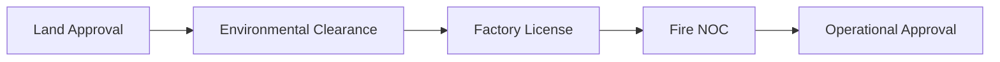
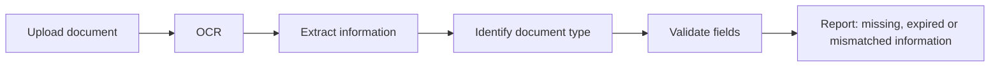
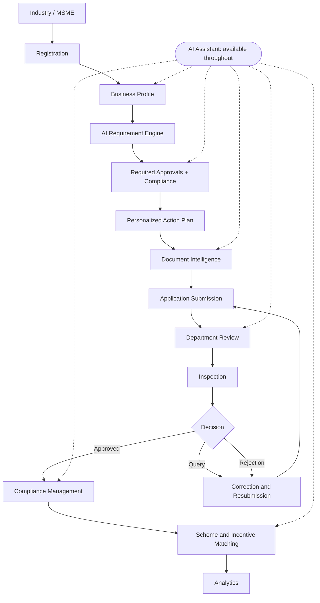
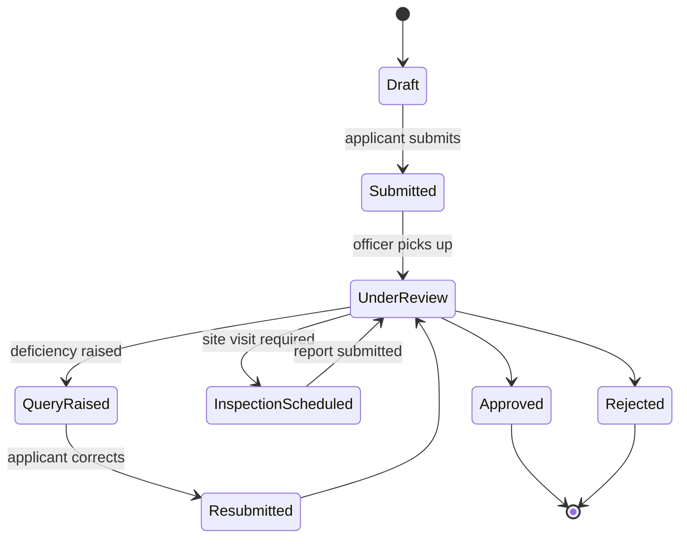
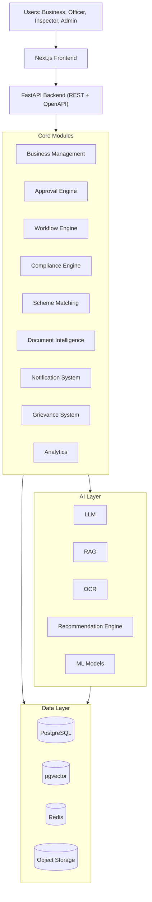
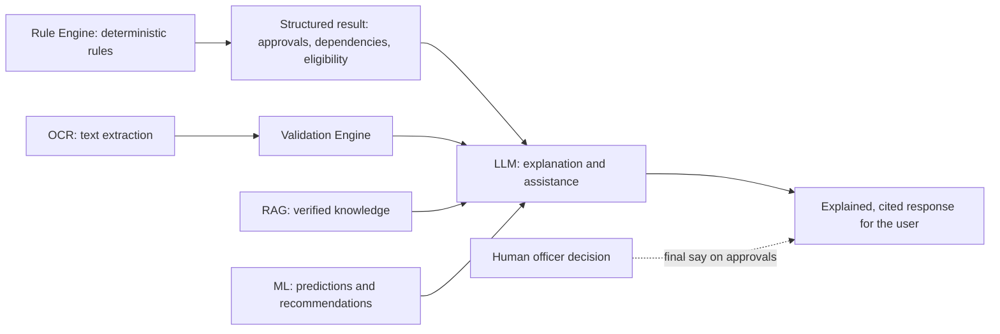
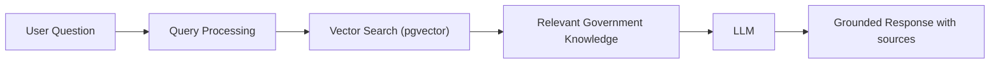
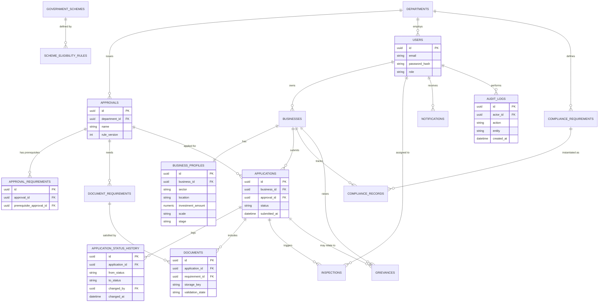

<div align="center">

# 🏭 AI-Powered Industrial Facilitation Platform

### From "Which approvals do I need?" to "Here is exactly what to do next."


**Problem statement:** *Efficiency in streamlining industrial approvals, compliance processes, and access to government support services.*

</div>

---

> [!IMPORTANT]
> **Honesty note.** This README separates what is built from what is proposed. Every capability carries one of three labels:
>
> | Label | Meaning |
> |---|---|
> | ✅ **Implemented** | Working in this repository today |
> | 🧪 **Prototype** | Partially working or demo-grade, using seeded or simulated data |
> | 🗺️ **Planned** | Designed but not yet built (also written as "To be implemented" or "Future Integration") |
>
> This project is a hackathon prototype. It is **not** an official government system. It has **no** integration with, or endorsement from, any government portal, department, or agency. All sample data is illustrative and clearly labelled as such.

<!-- TEAM: before submission, update every Status cell below so it matches the actual repository. Nothing in this file should claim more than the code delivers. -->

## 📑 Table of Contents

1. [The Problem](#-the-problem)
2. [Our Solution](#-our-solution)
3. [Core Innovation](#-core-innovation)
4. [Feature Status](#-feature-status)
5. [Key Unique Features](#-key-unique-features)
6. [Workflow](#-workflow)
7. [System Architecture](#-system-architecture)
8. [AI Architecture](#-ai-architecture)
9. [Technology Stack](#-technology-stack)
10. [User Roles and RBAC](#-user-roles-and-rbac)
11. [Database Design](#-database-design)
12. [API Documentation](#-api-documentation)
13. [Project Structure](#-project-structure)
14. [Local Development](#-local-development)
15. [Environment Variables](#-environment-variables)
16. [Usage](#-usage)
17. [Demo Scenario](#-demo-scenario)
18. [Security](#-security)
19. [Problem → Solution Map](#-problem--solution-map)
20. [Why This Solution](#-why-this-solution)
21. [Roadmap](#-roadmap)
22. [Future Scope](#-future-scope)
23. [Limitations and Scope](#-limitations-and-scope)
24. [Contributors](#-contributors)
25. [License](#-license)

---

## 🎯 The Problem

An entrepreneur setting up or running an industrial unit typically needs many registrations, licences, no-objection certificates (NOCs), inspections and renewals from different authorities. What is required depends on sector, location, size of investment and stage of the project.

**Applicants struggle with:**
- Knowing *which* approvals apply to their business, and in *what order*
- Knowing which documents each approval needs, and getting them right the first time
- Tracking status, answering departmental queries, and remembering renewals
- Discovering government schemes and incentives they may be eligible for

**Departments struggle with:**
- Incomplete or inconsistent applications
- Repeated scrutiny and manual coordination between departments
- Limited visibility into where applications get stuck
- Uneven monitoring of compliance

Existing single-window systems, such as Maharashtra's MAITRI and the national NSWS, address submission and tracking of applications. This project focuses on the **guidance layer above the forms**: helping a business understand its full approval and compliance journey and act on it.

## 💡 Our Solution

An **AI-powered Industrial Facilitation Platform** that helps industries and MSMEs navigate the complete lifecycle of government approvals, compliance requirements, and government schemes and incentives.

It is **not another online application portal.** Its purpose is to answer one question proactively:

> **"What do I need to do next?"**

so that businesses do not have to decode complicated government procedures themselves.

## 🚀 Core Innovation

```text
Business Profile
   → AI Requirement Discovery
   → Approval Dependency Mapping
   → Personalized Action Plan
   → Document Intelligence
   → Application Workflow
   → Compliance Management
   → Government Scheme Matching
   → Continuous AI Assistance
```

The platform keeps a live picture of a business (its profile, applications, documents, compliance obligations and scheme eligibility) and continuously turns that picture into the **next concrete action**.

**Design principle: deterministic rules decide, AI assists, humans approve.** Legally defined outcomes (which approval applies, whether an application is approved) never come from a language model. See [AI Architecture](#-ai-architecture).

## 📊 Feature Status

Legend: ✅ Implemented · 🧪 Prototype · 🗺️ Planned

| # | Capability | Status | Notes |
|---|---|---|---|
| 1 | Industry / MSME onboarding | 🗺️ Planned | Registration and login |
| 2 | Business profile creation | 🗺️ Planned | Sector, location, investment, scale, stage |
| 3 | AI-powered approval requirement discovery | 🗺️ Planned | Rule engine first; LLM explains |
| 4 | Personalized approval roadmap | 🗺️ Planned | Ordered action plan per business |
| 5 | Approval dependency visualization | 🗺️ Planned | Graph view with critical path |
| 6 | Document management | 🗺️ Planned | Upload, versioning, secure access |
| 7 | OCR-based document intelligence | 🗺️ Planned | PaddleOCR or Tesseract |
| 8 | Document validation | 🗺️ Planned | Missing, expired or mismatched fields |
| 9 | Application submission and tracking | 🗺️ Planned | Status history per application |
| 10 | Department workflow | 🗺️ Planned | Officer queue, queries, decisions |
| 11 | Inspection and approval tracking | 🗺️ Planned | Assignment, results, reports |
| 12 | Compliance management | 🗺️ Planned | Obligations generated from approvals |
| 13 | Compliance deadline and renewal alerts | 🗺️ Planned | Scheduled jobs and notifications |
| 14 | Government scheme and incentive matching | 🗺️ Planned | Rule-based eligibility with explanations |
| 15 | AI assistant | 🗺️ Planned | Context-aware help across the workflow |
| 16 | RAG-based government knowledge assistant | 🗺️ Planned | Grounded in curated, verified sources only |
| 17 | SLA / risk monitoring | 🗺️ Planned | Timeline tracking and explainable risk flags |
| 18 | Grievance and escalation management | 🗺️ Planned | Raise, track, escalate |
| 19 | Analytics dashboard | 🗺️ Planned | Pendency, stage delays, query reasons |
| 20 | Audit logging | 🗺️ Planned | Append-only record of actions |
| — | What-If Business Simulator | 🗺️ Planned | Prototype target for the demo if time permits |

## ✨ Key Unique Features

### 1. AI Approval Navigator
Analyses the business profile and identifies **potentially required** approvals, licences, NOCs and compliance requirements. Applicability is decided by a **versioned, deterministic rule set**. The language model explains *why* a rule matched, in plain language, and never decides applicability by itself. Every recommendation shows the rule that produced it.

### 2. Approval Dependency Graph
Shows how approvals depend on each other, which can run in parallel, which are blocked, and which one gates go-live (the critical path).



> This chain is an **illustrative example** of the visualization. Real dependencies vary by state, sector and project, and will come from a curated, sourced rule set (🗺️ Planned), not from this diagram.

### 3. Intelligent Document Validation



Extracted values are shown to the user for confirmation before they are used. OCR output is treated as a suggestion, not as truth.

### 4. AI Next-Action Engine
Looks at the current state of an application and tells the business what to do next.

- A **deterministic state machine** decides *which* action is pending (for example, "a revised document is required").
- The **LLM** rewrites the officer's deficiency note into a clear, actionable task for the applicant.

Example: *"Your application requires a revised pollution-control document before it can proceed."*

### 5. Government Scheme Matching
Matches a business profile against scheme eligibility rules and **explains the eligibility factors** (which criteria are met, which are not, and which information is missing). Scheme data will be curated from official sources; no scheme dataset ships with this repository today.

### 6. What-If Business Simulator (🗺️ Planned / Prototype target)
Lets a user change investment amount, industry type, location or scale and see how approvals, compliance requirements and scheme eligibility would change.

Approach: re-run the same deterministic rule engine on the modified profile and **show the difference** against the current profile. The LLM only summarises the diff. This keeps results explainable and reproducible.

## 🔄 Workflow

The AI Assistant is a **cross-cutting component** available at every stage, not only at the end.



**Proposed application lifecycle**



## 🏗️ System Architecture

> Proposed architecture. Component status is listed in [Feature Status](#-feature-status).



| Layer | Responsibility |
|---|---|
| **Frontend** | Role-based dashboards for business users, officers, inspectors and admins |
| **Backend** | REST API, authentication, RBAC, validation, orchestration |
| **Core modules** | Business rules, workflows, compliance, schemes, documents, notifications, grievances, analytics |
| **AI layer** | Explanation, retrieval, OCR, recommendations, predictions |
| **Data layer** | Relational data, vector embeddings, cache and job queue, document storage |

## 🧠 AI Architecture

AI is **not** used blindly for legally defined decisions. Each component has a bounded job:

| Component | Role | Must **not** be used for |
|---|---|---|
| **Rule Engine** | Deterministic government and business rules: which approvals apply, prerequisites, eligibility criteria | — (source of truth for applicability) |
| **OCR** | Text extraction from uploaded documents | Treating extracted text as verified fact without user or officer confirmation |
| **RAG** | Retrieves verified knowledge from a curated document set | Answering from outside the curated corpus |
| **LLM** | Explanation, conversational assistance, summarisation, rewriting deficiencies into tasks | Deciding applicability, eligibility or approval outcomes |
| **ML** | Predictions and recommendations where suitable (for example delay-risk indicators) | Legal determinations; must be explainable and validated on real data before any claim of accuracy |



**RAG flow**



**Grounding rules (design commitments)**
- Answers must cite the retrieved source passages they rely on.
- If retrieval finds no supporting evidence, the assistant says it does not know and points to the relevant office or official portal, instead of guessing.
- The knowledge base contains only documents the team has curated from official sources. Its contents and versions are documented in `docs/` once built. 🗺️ Planned
- The assistant gives guidance, not legal advice. Final decisions rest with the responsible department.

## 🧰 Technology Stack

> All entries below are the **proposed stack**. Update the Status column as components land in the repository.

| Area | Technology | Status |
|---|---|---|
| Frontend | Next.js, React, TypeScript, Tailwind CSS, shadcn/ui | Proposed |
| Backend | Python, FastAPI | Proposed |
| Database | PostgreSQL, pgvector | Proposed |
| AI | Gemini or a suitable LLM API, RAG, embeddings, Python AI services | Proposed |
| Document intelligence | PaddleOCR or Tesseract, document extraction, validation engine | Proposed |
| Machine learning | Python, scikit-learn / XGBoost where required | Proposed |
| Caching / background jobs | Redis | Proposed |
| Storage | S3-compatible object storage | Proposed |
| Deployment | Docker; Vercel (frontend); Render / Google Cloud Run or equivalent (backend) | Proposed |
| API | REST, OpenAPI / Swagger | Proposed |
| Security | JWT, RBAC, password hashing, API validation, rate limiting, audit logging, secure document access | Proposed |

## 👥 User Roles and RBAC

| Capability | Business User | Officer | Inspector | Admin |
|---|:---:|:---:|:---:|:---:|
| Manage business profile | ✔ | | | |
| Discover approvals | ✔ | | | |
| Upload documents | ✔ | | | |
| Submit and track applications | ✔ | | | |
| Manage compliance | ✔ | | | |
| Discover schemes | ✔ | | | |
| Use AI assistant | ✔ | | | |
| Review applications | | ✔ | | |
| Raise document queries | | ✔ | | |
| Update application status | | ✔ | | |
| Manage approvals (department scope) | | ✔ | | |
| View assigned inspections | | | ✔ | |
| Update inspection results | | | ✔ | |
| Submit inspection reports | | | ✔ | |
| Manage users and departments | | | | ✔ |
| Manage approval rules and schemes | | | | ✔ |
| View analytics | | | | ✔ |
| Audit system activity | | | | ✔ |

Officers see only applications routed to their own department. Inspectors see only inspections assigned to them. Business users see only their own data.

## 🗄️ Database Design

**Major entities:** `Users`, `Businesses`, `BusinessProfiles`, `Departments`, `Approvals`, `ApprovalRequirements`, `Applications`, `ApplicationStatusHistory`, `Documents`, `DocumentRequirements`, `ComplianceRequirements`, `ComplianceRecords`, `GovernmentSchemes`, `SchemeEligibilityRules`, `Inspections`, `Grievances`, `Notifications`, `AuditLogs`.

> Proposed schema. Fields are indicative and will change during implementation.



Design notes:
- `ApplicationStatusHistory` and `AuditLogs` are **append-only**.
- Approval prerequisites are stored as data (`ApprovalRequirements`), so the dependency graph is generated from the database and not hard-coded.
- Rules carry a `rule_version` so a recommendation can always be traced to the rule set that produced it.
- Document embeddings for RAG live in pgvector alongside their source metadata.

## 🔌 API Documentation

> ⚠️ **These endpoints are an example API design (🗺️ Planned), not a description of implemented behaviour.** Once the backend runs, the live and authoritative reference is the auto-generated OpenAPI documentation at `/docs`.

| Method | Endpoint | Purpose | Roles |
|---|---|---|---|
| POST | `/api/auth/register` | Register a new user | Public |
| POST | `/api/auth/login` | Authenticate and receive a JWT | Public |
| GET | `/api/business/profile` | Get the current business profile | Business |
| PUT | `/api/business/profile` | Create or update the business profile | Business |
| GET | `/api/approvals/recommended` | Approvals and dependencies for the profile | Business |
| GET | `/api/approvals/{id}` | Approval details, prerequisites, required documents | Authenticated |
| POST | `/api/applications` | Create or submit an application | Business |
| GET | `/api/applications` | List applications (scoped by role) | Business, Officer |
| GET | `/api/applications/{id}` | Application detail with status history | Business, Officer |
| POST | `/api/documents/upload` | Upload a document | Business |
| POST | `/api/documents/validate` | OCR, extract and validate a document | Business, Officer |
| GET | `/api/compliance` | Compliance obligations and records | Business |
| GET | `/api/compliance/upcoming` | Upcoming deadlines and renewals | Business |
| GET | `/api/schemes/recommended` | Schemes matched to the profile, with eligibility reasons | Business |
| POST | `/api/ai/chat` | Ask the assistant a question | Authenticated |
| POST | `/api/grievances` | Raise a grievance | Business |
| GET | `/api/grievances` | List grievances (scoped by role) | Business, Officer, Admin |
| GET | `/api/analytics/dashboard` | Aggregated metrics | Admin |

Additional examples for other roles: `PATCH /api/applications/{id}/status` (Officer), `GET /api/inspections/assigned` (Inspector), `POST /api/inspections/{id}/report` (Inspector), `GET /api/admin/audit-logs` (Admin).

**Illustrative response shape** for `GET /api/approvals/recommended` (placeholder values, not official data):

```json
{
  "business_id": "<uuid>",
  "rule_set_version": "<version>",
  "approvals": [
    {
      "id": "<uuid>",
      "name": "<approval name>",
      "department": "<department name>",
      "depends_on": ["<approval id>"],
      "matched_rules": ["<rule id>"],
      "explanation": "<plain-language reason, generated from matched rules>"
    }
  ]
}
```

## 📁 Project Structure

> **Proposed monorepo layout.** If the real repository differs, replace this section with the actual tree (for example, generated with `tree -L 3 -I "node_modules|.venv|.next|__pycache__"`).

```text
project/
├── frontend/                # Next.js + TypeScript app
│   ├── app/                 # Routes and pages
│   ├── components/          # UI components (shadcn/ui based)
│   ├── lib/                 # API client, utilities
│   └── public/
│
├── backend/                 # FastAPI service
│   ├── app/
│   │   ├── api/             # Route handlers
│   │   ├── models/          # SQLAlchemy models
│   │   ├── schemas/         # Pydantic schemas
│   │   ├── services/        # Business logic (workflow, compliance, schemes)
│   │   ├── ai/              # RAG, prompts, LLM client
│   │   ├── ocr/             # OCR and extraction
│   │   ├── rules/           # Deterministic approval / eligibility rules
│   │   └── core/            # Config, security, dependencies
│   └── tests/
│
├── docs/                    # Architecture notes, rule sources, knowledge-base manifest
├── docker/                  # Dockerfiles and helper scripts
├── .env.example
├── docker-compose.yml
└── README.md
```

## 🛠️ Local Development

> ⚠️ **Template instructions.** These commands follow the proposed structure and conventional tooling. Verify each step against the actual repository (`package.json`, `requirements.txt`, migration setup) and correct anything that differs.

**Prerequisites (proposed versions):** Node.js 20+, Python 3.11+, PostgreSQL 15+ with the `pgvector` extension, Redis 7+ (if background jobs are enabled), Docker (optional).

**1. Clone the repository**
```bash
git clone <your-repository-url>
cd <repository-folder>
```

**2. Install frontend dependencies**
```bash
cd frontend
npm install
cd ..
```

**3. Install backend dependencies**
```bash
cd backend
python -m venv .venv
source .venv/bin/activate        # Windows: .venv\Scripts\activate
pip install -r requirements.txt
cd ..
```

**4. Configure environment variables**
```bash
cp .env.example .env
# Edit .env and fill in your own values. Never commit this file.
```

**5. Start PostgreSQL** (with pgvector) and **6. Redis** (if required)
```bash
docker compose up -d postgres redis
```
Enable the vector extension once per database:
```sql
CREATE EXTENSION IF NOT EXISTS vector;
```

**7. Run database migrations**
```bash
cd backend
alembic upgrade head
```

**8. Start the backend**
```bash
uvicorn app.main:app --reload --port 8000
```

**9. Start the frontend** (new terminal)
```bash
cd frontend
npm run dev
```

**10. Open the application**
- Frontend: http://localhost:3000
- API docs (Swagger UI): http://localhost:8000/docs

**Alternative: Docker Compose** (🗺️ Planned)
```bash
docker compose up --build
```

## 🔐 Environment Variables

Create a `.env` file (backend) from `.env.example`. Use placeholders in the example file and **never commit real secrets**.

```dotenv
# Database
DATABASE_URL=

# Auth
JWT_SECRET=

# AI
LLM_API_KEY=
GOOGLE_API_KEY=

# Cache / jobs
REDIS_URL=

# Object storage (S3-compatible)
S3_ENDPOINT=
S3_ACCESS_KEY=
S3_SECRET_KEY=
```

> [!WARNING]
> `.env` files containing secrets must **never** be committed to version control. Keep `.env` in `.gitignore`, commit only `.env.example` with empty values, and rotate any key that is ever exposed. In deployment, use the hosting platform's secret manager.

## 🧭 Usage

1. **Register** as a business user and create a **business profile**.
2. Open **Approvals** to see the recommended approvals and the **dependency graph**.
3. Follow the **action plan**: upload documents, review the OCR-extracted fields, fix flagged issues.
4. **Submit** the application and watch its **status timeline**.
5. Respond to any officer query using the generated **action item**.
6. Once approved, open **Compliance** for deadlines and renewals, and **Schemes** for matched incentives.
7. Ask the **AI assistant** at any point, for example "What is blocking my application?".

Officer, inspector and admin views are available to accounts with those roles. Demo accounts and seed data: 🗺️ Planned (a seed script will create clearly labelled illustrative data).

## 🎬 Demo Scenario

A **manufacturing company** goes through the platform end to end. The demo uses seeded, illustrative data and simulated department roles. It does not connect to any live government system.

| Step | What happens | What judges see | Module |
|---|---|---|---|
| 1 | The company registers and creates a business profile | Onboarding and profile form | Business Management |
| 2 | The system analyses the profile | Rule engine runs on sector, location, investment, scale | Approval Engine |
| 3 | AI identifies the required approvals | List of approvals with the rule and reason behind each | AI Approval Navigator |
| 4 | A roadmap is generated | Ordered, personalised action plan | Approval Engine |
| 5 | The user views approval dependencies | Interactive dependency graph and critical path | Dependency Graph |
| 6 | The user uploads documents | Upload with per-approval requirement checklist | Document Management |
| 7 | OCR extracts document information | Extracted fields shown for confirmation | Document Intelligence |
| 8 | The validation engine checks documents | Missing, expired or mismatched items flagged | Validation Engine |
| 9 | The application is submitted | Status timeline begins | Workflow Engine |
| 10 | An officer reviews the application | Officer queue and review screen | Department Workflow |
| 11 | The officer raises a deficiency | Structured query on a specific document | Department Workflow |
| 12 | AI converts the deficiency into an actionable task | Plain-language task for the applicant | AI Next-Action Engine |
| 13 | The user uploads the corrected document | Re-validation runs | Document Intelligence |
| 14 | The application is resubmitted | Status history shows the full loop | Workflow Engine |
| 15 | The compliance dashboard becomes active | Obligations, deadlines and renewals | Compliance Engine |
| 16 | The system recommends relevant schemes | Matches with eligibility reasons | Scheme Matching |
| 17 | The AI assistant answers questions | Cited, grounded answers | RAG Assistant |
| 18 | The dashboard shows the complete business status | One consolidated view | Analytics |

> 📸 **Screenshots:** to be added once the UI is built. No mock-ups are presented as real screens.

## 🛡️ Security

> Security controls below are design commitments for the prototype. Confirm the status of each in the repository before relying on it.

| Area | Approach |
|---|---|
| **Authentication** | Email and password login issuing short-lived JWT access tokens |
| **RBAC** | Role checks on every endpoint and record-level scoping (business, department, assignment) |
| **Password hashing** | Salted, slow hashing (Argon2 or bcrypt); plain-text passwords are never stored or logged |
| **JWT** | Signed tokens with expiry; secret loaded from the environment |
| **Input validation** | Pydantic schemas on all request bodies; parameterised queries through the ORM |
| **API protection** | Rate limiting (Redis-backed), CORS restricted to known origins |
| **File validation** | Allow-listed file types, size limits, content-type checks; malware scanning is future scope |
| **Secure file storage** | Private object-storage bucket; access through short-lived signed URLs after an authorisation check |
| **Audit logs** | Append-only log of sensitive actions (login, upload, status change, approval decision, admin change) |
| **Protection of business documents** | Least-privilege access, no public links, encryption in transit, encryption at rest where the storage provider supports it |
| **Secrets management** | Environment variables and platform secret managers; nothing secret in the repository |
| **AI safety** | Uploaded content and retrieved text are treated as untrusted input to the LLM; the LLM cannot trigger status changes or approvals |

## 🔁 Problem → Solution Map

| Problem | Current difficulty | Our solution | Technology |
|---|---|---|---|
| Fragmented approval information | Businesses must search multiple sources to learn what applies | One profile-driven list of potentially required approvals and compliance items, each with the reason it applies | Rule engine, PostgreSQL |
| Complex approval dependencies | Order and prerequisites are unclear, causing delays and rework | Dependency graph with parallel and blocked steps and the critical path | Graph model in PostgreSQL, Next.js visualisation |
| Document errors | Rejections and repeated queries due to missing, expired or mismatched documents | OCR, extraction and field validation before submission | PaddleOCR / Tesseract, validation engine |
| Poor application visibility | Applicants lack clarity on status and what is pending | Status timeline plus a Next-Action Engine that states what to do now | Workflow state machine, LLM for wording |
| Compliance deadlines | Renewals and periodic obligations are easy to miss | Obligations generated per approval, with deadline and renewal alerts | Compliance engine, Redis-backed scheduled jobs |
| Difficulty discovering schemes | Eligibility criteria are scattered and hard to interpret | Profile-to-scheme matching with eligibility explanations | Rule-based matching, LLM explanations |
| Lack of personalised guidance | Generic information does not fit a specific business | Personalised roadmap, RAG assistant grounded in curated sources | RAG, pgvector, embeddings, LLM |
| Lack of analytics | Delays and repeat queries are hard to see across applications | Dashboard of pendency, stage-wise delays and common query reasons | SQL analytics, dashboards |

## 🌟 Why This Solution

- **Transparency.** Every recommendation shows the rule behind it, and every status change is recorded.
- **Ease of doing business.** Businesses get an ordered plan instead of having to interpret procedures themselves.
- **Application visibility.** A single timeline per application, with the pending action stated in plain language.
- **Compliance awareness.** Obligations and renewals are surfaced before they become deadlines missed.
- **Document accuracy.** Problems are caught before submission, so fewer applications bounce back for avoidable reasons.
- **Access to government support.** Scheme matching brings eligible incentives to the business's attention.
- **User experience.** One dashboard, plain-language explanations, and an assistant that is available throughout.
- **Administrative efficiency.** Cleaner submissions, structured queries and analytics on where applications stall.

> These are design goals. We do not claim measured percentage improvements, because none have been measured. Any future figures will come from documented tests or pilots.

## 🗺️ Roadmap

### Phase 1 — SIH Prototype
Core workflow and demo.
- [ ] Authentication and role-based access
- [ ] Business profile and rule-driven approval discovery
- [ ] Approval roadmap and dependency graph
- [ ] Document upload with OCR and basic validation
- [ ] Application submission, officer review, query and resubmission loop
- [ ] Compliance dashboard with deadlines
- [ ] Rule-based scheme matching with explanations
- [ ] Grounded AI assistant on a small curated knowledge base
- [ ] Audit logging

### Phase 2 — Intelligent Platform
Advanced AI, document intelligence and analytics.
- [ ] Broader, sourced rule sets across more sectors and locations
- [ ] Improved document classification and extraction
- [ ] SLA and risk monitoring with explainable indicators
- [ ] Analytics on stage delays and repeat-query causes
- [ ] What-If Business Simulator
- [ ] Grievance and escalation workflow

### Phase 3 — Production Integration
Potential integration with official government systems and APIs, **subject to authorisation and availability**.
- [ ] Assessment of official integration options with the relevant authorities
- [ ] Production-grade security review, privacy and consent handling
- [ ] Scalability, monitoring and operations

## 🔭 Future Scope

- Government portal integrations (Future Integration, subject to authorisation)
- More advanced ML models, validated on real data before any accuracy claim
- Multilingual support, including regional languages
- Voice-based assistant
- Mobile application
- Advanced predictive analytics
- Automated notifications (email, SMS, in-app)
- Digital document verification with issuing sources
- Business What-If simulation at scale
- Large-scale deployment

## ⚠️ Limitations and Scope

- This is a **hackathon prototype**, not a production system, and it is **not affiliated with or endorsed by** any government body.
- **No official government APIs or datasets are used** unless a later section of this README says so explicitly.
- Approval, compliance and scheme content in the demo is **illustrative** and must be verified against official sources before any real-world use.
- AI output is guidance, not legal advice. Final decisions rest with the responsible authority.
- OCR and language-model output can be wrong; the design keeps a human in the loop for confirmation and decisions.

## 🤝 Contributors

| Name | Role | GitHub |
|---|---|---|
| Arslan Ansari | _Team Leader| [@username](https://github.com/username) |
| _Add name_ | _Add role_ | [@username](https://github.com/username) |

**Team name:** _add here_ · **Institution:** _add here_ · **SIH 2026 problem statement:** SIH26130

## 📄 License

License: **to be selected by the team** (for example MIT or Apache-2.0). Add a `LICENSE` file to the repository root and update the badge at the top of this README.

---

<div align="center">

Built for **Smart India Hackathon 2026** · Problem Statement **SIH26130**

</div>
<--help test commit -->
