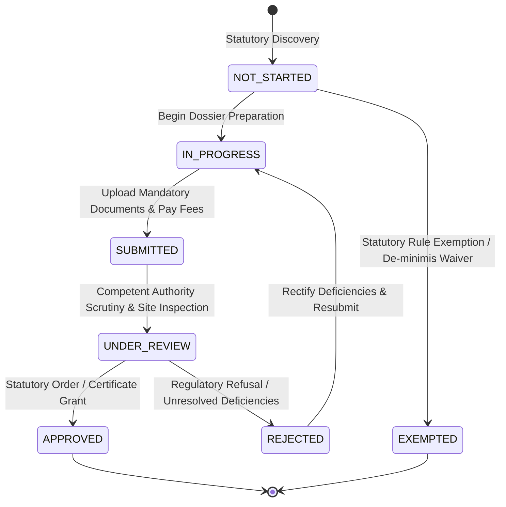
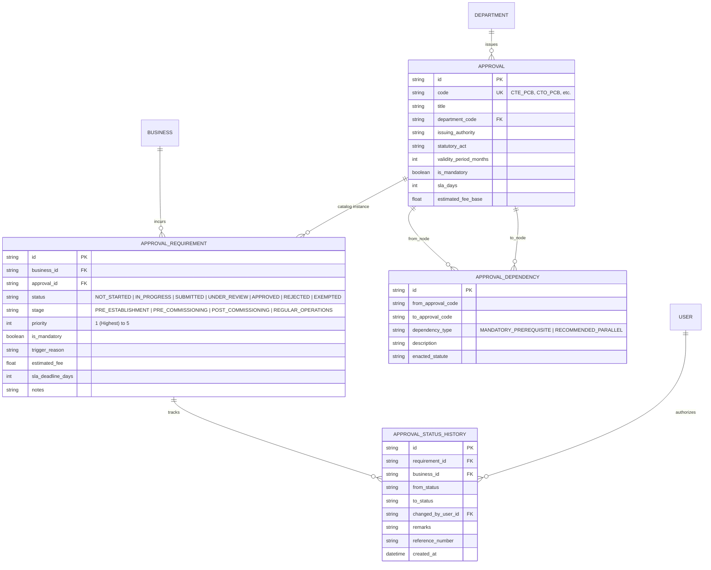

# UdyamSetu AI — Regulatory Approval & Clearance Engine Architecture

> **Fragment 58**: Comprehensive Technical Architecture, Data Models, Rule Systems, DAG Algorithms, and REST APIs for Phase 4.

---

## 1. Executive Summary

The **UdyamSetu AI Approval Engine** is an intelligent regulatory orchestration system designed for the Smart India Hackathon 2026 (Problem Statement SIH26130). It transforms the traditionally fragmented, opaque, and manual industrial clearance process into a deterministic, algorithmic, and transparent Single-Window Clearance ecosystem.

### Core Capabilities
1. **Automated Statutory Discovery**: Evaluates enterprise parameters (CPCB pollution tier, MSME scale, power/water loads, hazardous processes, factory acreage) against statutory Acts to discover mandatory and conditional clearances.
2. **Topological Dependency DAG**: Sequences clearances via a Directed Acyclic Graph (DAG), preventing circular deadlocks and determining valid application order.
3. **Critical Path Turnaround**: Computes the longest statutory path through the clearance DAG, highlighting the exact bottleneck clearances dictating plant commissioning.
4. **Personalized Forward-Pass Roadmap**: Calculates calendar milestone dates, SLA day offsets, and parallel execution tracks.
5. **Dynamic Next-Action Engine**: Recommends immediate prioritized actions for industrial promoters based on prerequisite unlock states, document readiness, and SLA countdowns.
6. **Immutable Audit History**: Tracks status transitions with timestamps, actor IDs, officer remarks, and statutory reference numbers.

---

## 2. Clearance Lifecycle State Machine

---

## 3. Relational Domain Model Architecture

---

## 4. Statutory Clearance Catalog & Act Mapping

| Code | Clearance Title | Issuing Department | Governing Statute | Default SLA |
| :--- | :--- | :--- | :--- | :--- |
| `CTE_PCB` | Consent to Establish (CTE) | State Pollution Control Board | Water Act 1974 & Air Act 1981 | 45 Days |
| `CTO_PCB` | Consent to Operate (CTO) | State Pollution Control Board | Water Act 1974 & Air Act 1981 | 45 Days |
| `FACTORY_LIC` | Factory Registration & License | Directorate of Industrial Safety & Health (DISH) | Factories Act, 1948 - Section 6 | 30 Days |
| `FIRE_NOC` | Fire Safety & Prevention NOC | State Fire & Emergency Services | State Fire Prevention & Safety Measures Act | 30 Days |
| `POWER_HT` | High-Tension Power Connectivity | State Electricity Distribution Utility | Electricity Act, 2003 | 30 Days |
| `CGWA_GW` | Central Ground Water Authority NOC | Central Ground Water Authority | Environment (Protection) Act, 1986 | 60 Days |
| `LAND_CONV` | Agricultural Land Conversion (NA NOC) | Revenue & District Collectorate | State Land Revenue Code | 60 Days |
| `BOILER_REG` | Boiler Registration Certificate | Directorate of Steam Boilers | Indian Boilers Act, 1923 | 21 Days |

---

## 5. Algorithmic Engines

### 5.1 Kahn's Topological Sort & Dependency Engine
The DAG Engine (`app.services.dependency_engine.py`) models clearances as nodes $V$ and prerequisites as directed edges $E = (u, v)$ where approval $u$ is a mandatory prerequisite for approval $v$.

1. **In-Degree Computation**: Calculate the number of incoming prerequisite edges for every clearance node.
2. **Zero-In-Degree Queue**: Clearances with $in\_degree = 0$ (e.g. `CTE_PCB`, `FIRE_NOC`, `LAND_CONV`) are independent and unlocked for immediate execution.
3. **Topological Linearization**: Clearances are dequeued, appending to the linear order, and decrements downstream node in-degrees until all valid nodes are ordered.
4. **Cycle Detection**: If the processed node count is less than $|V|$, a circular dependency deadlock is flagged and reported.

### 5.2 Critical Path Method (CPM)
The longest path algorithm calculates project duration:
$$\text{dist}(v) = \max_{(u, v) \in E} \left( \text{dist}(u) + \text{SLA}(v) \right)$$
Nodes along this path are marked `is_critical = True`. Any delay in a critical path clearance directly postpones commercial plant energization.

### 5.3 Forward-Pass Milestone Scheduling
`RoadmapService` maps DAG start offsets to actual calendar dates starting from $T_0$:
- $\text{StartDay}(v) = \max_{u \in \text{Prereqs}(v)} \text{FinishDay}(u)$
- $\text{FinishDay}(v) = \text{StartDay}(v) + \text{SLA}(v)$
- $\text{CalendarStart}(v) = T_0 + \text{StartDay}(v)$
- $\text{CalendarFinish}(v) = T_0 + \text{FinishDay}(v)$

### 5.4 Dynamic Next-Action Prioritization Score
`NextActionEngineService` assigns dynamic scores to rank actionable items:
- **Critical Path Unlocked**: $\text{Score} = 100 - \text{StagePenalty}$ (Highest Priority)
- **Non-Critical Unlocked In-Progress**: $\text{Score} = 80$ (High Priority)
- **Non-Critical Unlocked Not Started**: $\text{Score} = 75$ (High Priority)
- **Under Review / Tracking SLA**: $\text{Score} = 60 \text{ (or } 90 \text{ if critical)}$
- **Prerequisites Blocked**: $\text{Score} = 25$ (Deferred until unblocked)
- **Approved / Completed**: $\text{Score} = 10$ (Certificate download)

---

## 6. REST API Reference

| Method | Endpoint | Description | Request Body | Response Model |
| :--- | :--- | :--- | :--- | :--- |
| `POST` | `/api/v1/approvals/discover/{business_id}` | Run statutory rule discovery engine | None | `DiscoveryResponse` |
| `GET` | `/api/v1/approvals/business/{business_id}` | List active clearance requirements | None | `List[ApprovalRequirementRead]` |
| `GET` | `/api/v1/approvals/summary/{business_id}` | Consolidated fee and SLA metrics | None | `ClearanceSummaryRead` |
| `GET` | `/api/v1/approvals/requirements/{id}` | Individual requirement detail | None | `ApprovalRequirementRead` |
| `PATCH` | `/api/v1/approvals/requirements/{id}/status` | Update status & record audit history | `ApprovalStatusUpdatePayload` | `ApprovalRequirementRead` |
| `GET` | `/api/v1/approvals/{code}/checklist` | Statutory document checklist | None | `ApprovalChecklistRead` |
| `GET` | `/api/v1/approvals/requirements/{id}/checklist`| Requirement instance checklist | None | `ApprovalChecklistRead` |
| `GET` | `/api/v1/approvals/graph/{business_id}` | Topological DAG & critical path | None | `DependencyGraphResponse` |
| `GET` | `/api/v1/approvals/roadmap/{business_id}` | Milestone Gantt forward pass | None | `RoadmapPlanResponse` |
| `GET` | `/api/v1/approvals/next-actions/{business_id}` | Prioritized action recommendations | None | `NextActionSummaryResponse` |
| `GET` | `/api/v1/approvals/requirements/{id}/history` | Chronological requirement audit trail | None | `List[ApprovalStatusHistoryRead]` |
| `GET` | `/api/v1/approvals/history/{business_id}` | Enterprise-wide transition audit log | None | `List[ApprovalStatusHistoryRead]` |

---

## 7. Frontend User Experience & View Switchers

The frontend approval subsystem delivers five specialized interfaces connected via unified view switchers:

1. **Clearance Catalog Cards (`/approvals`)**: Stage-filtered requirement cards highlighting issuing authority, statutory acts, fee breakdown, and status controls.
2. **Clearance Detail & Dossier Checklist (`/approvals/[id]`)**: Deep-dive page with 5 tabs: Dossier Checklist, Lifecycle Audit Trail, Legal Authority, Single-Window Workflow, and Grievance Desk.
3. **Dependency DAG Graph (`/approvals/graph`)**: Interactive visual node-link DAG rendering unlocked nodes in green, critical path nodes in crimson, and blocked nodes in slate.
4. **Milestone Gantt Roadmap (`/approvals/roadmap`)**: Calendar timeline with phase milestone aggregations, forward-pass progress bars, and critical path badges.
5. **Next-Action Queue (`/approvals/actions`)**: Dynamic task list ranking immediate steps, spotlighting the #1 recommended action with statutory justification.

---

## 8. Verification & Test Suite Summary

Phase 4 contains **35 automated test suites** passing with 100% test coverage:

- `test_approval_model.py`: Catalog schema validation, constraints, and relationships.
- `test_approval_requirement_model.py`: Stage enums, foreign keys, fee math.
- `test_department_model.py`: Department authorities, jurisdiction tiers.
- `test_approval_rules.py`: CPCB Red/Orange/Green rule logic and statutory fee formulas.
- `test_requirement_engine.py`: Profile discovery, reconciliation, idempotency.
- `test_approval_api.py`: Discovery endpoints, business listings, authorization checks.
- `test_approval_checklist.py`: Document prerequisites, category classifications.
- `test_approval_dependency_model.py`: Dependency types, edge uniqueness.
- `test_dependency_engine.py`: Kahn's algorithm, cycle prevention, critical path.
- `test_dependency_graph_api.py`: Graph node states, unlock mappings.
- `test_roadmap_service.py`: Forward pass scheduling, day offsets, milestone grouping.
- `test_next_action_engine.py`: Priority queue rankings, prerequisite unblocking progression.
- `test_approval_status_history.py`: Immutable transition tracking, remarks, reference numbers.
- `test_approval_workflow_e2e.py`: Complete lifecycle integration & strict RBAC isolation.
